# Smart E-Commerce Platform with 3D & AR Product Preview

An advanced, next-generation E-Commerce web application designed to revolutionize the online shopping experience by integrating full 3D product visualization and Augmented Reality (AR) previews.

---

## 🚀 Key Features

* **Interactive 3D Visualization:** Customers can rotate, zoom, and inspect products from every angle in high-definition 3D before making a purchase.
* **Augmented Reality (AR) Preview:** Allows users to virtually place products (like furniture, electronics, or decor) in their real-world environment using their smartphone camera.
* **Smart Native Multi-Language Support:** User-friendly interface designed to support regional languages for seamless navigation.
* **Modern & Responsive UI:** Optimized for a flawless experience across mobile, tablet, and desktop devices.
* **Advanced Cart & Checkout:** Secure and smooth user flow from product discovery to successful order placement.

---

## 🛠️ Tech Stack

* **Frontend:** HTML5, CSS3, JavaScript (ES6+) / React.js
* **3D/AR Rendering:** Google's `<model-viewer>` / Three.js / WebXR
* **Styling:** Tailwind CSS / Bootstrap
* **Version Control:** Git & GitHub

---

## 📸 Project Screenshots

Here are the visual highlights and interface previews of the platform:

<table>
  <tr>
    <td>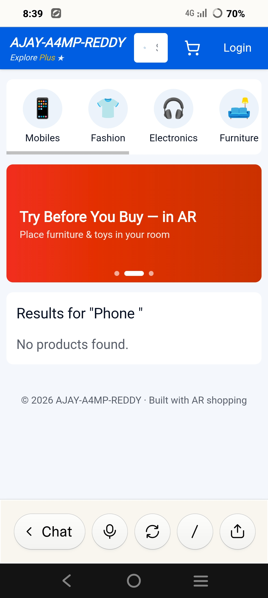</td>
    <td>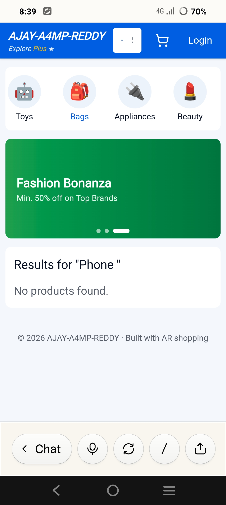</td>
    <td>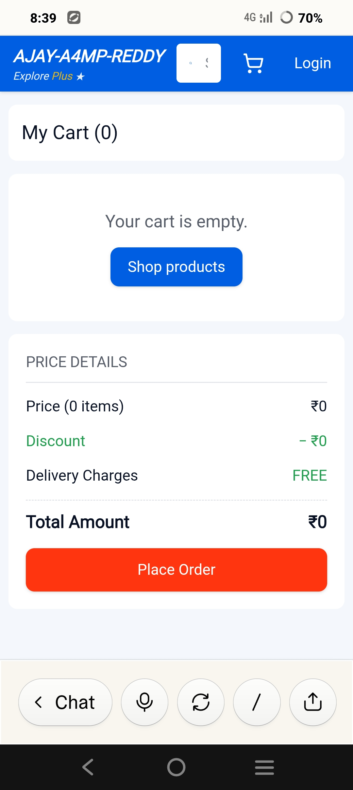</td>
  </tr>
  <tr>
    <td>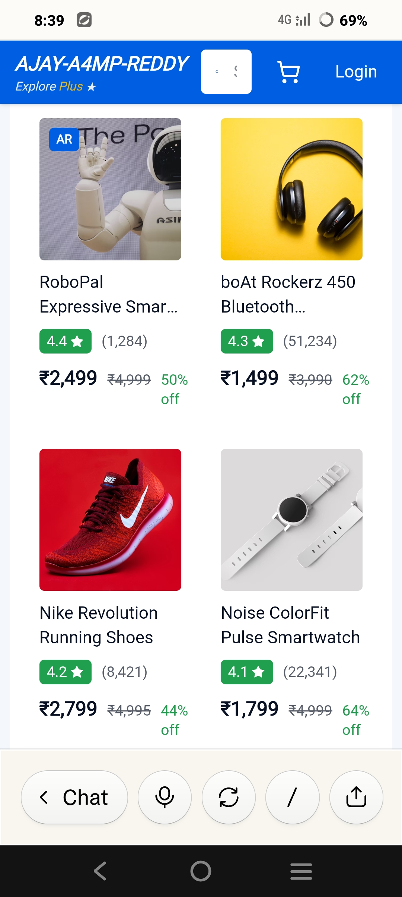</td>
    <td>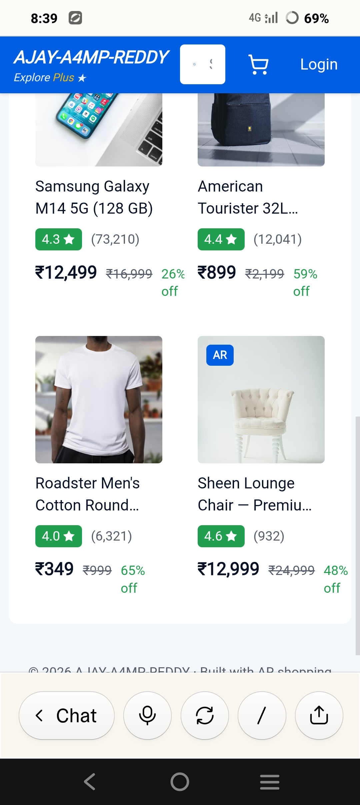</td>
    <td>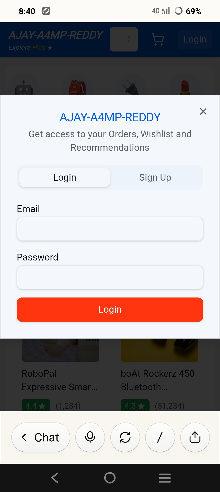</td>
  </tr>
  <tr>
    <td>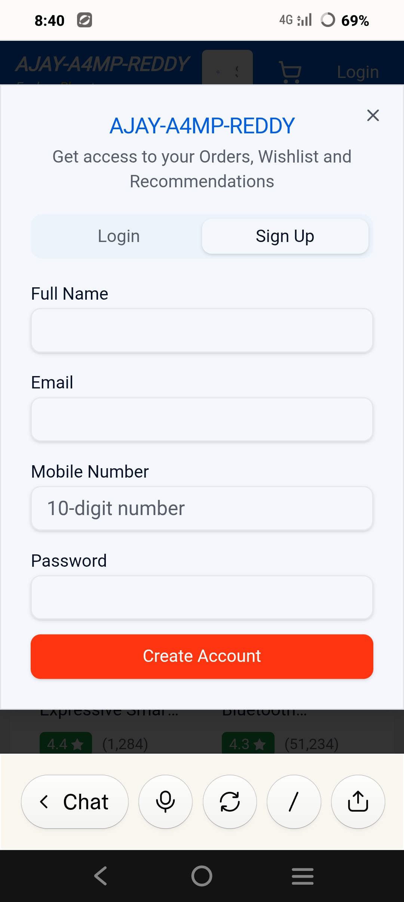</td>
    <td>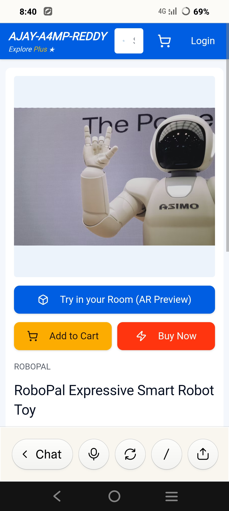</td>
    <td>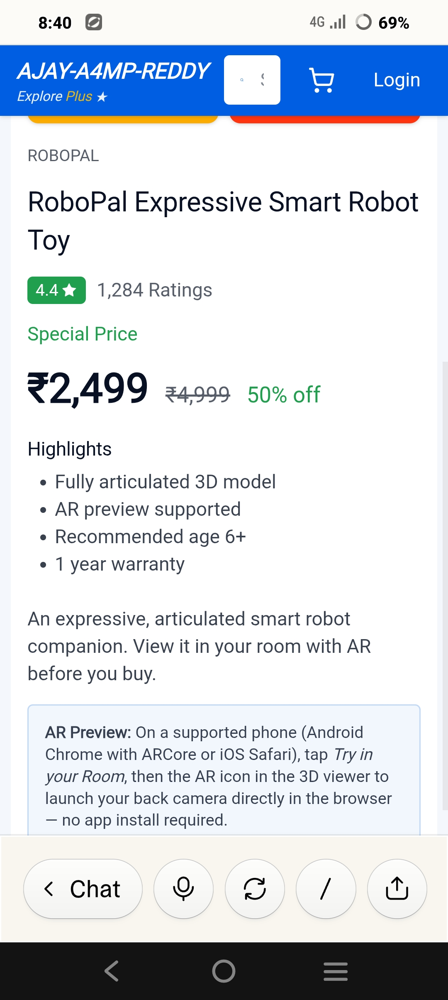</td>
  </tr>
  <tr>
    <td>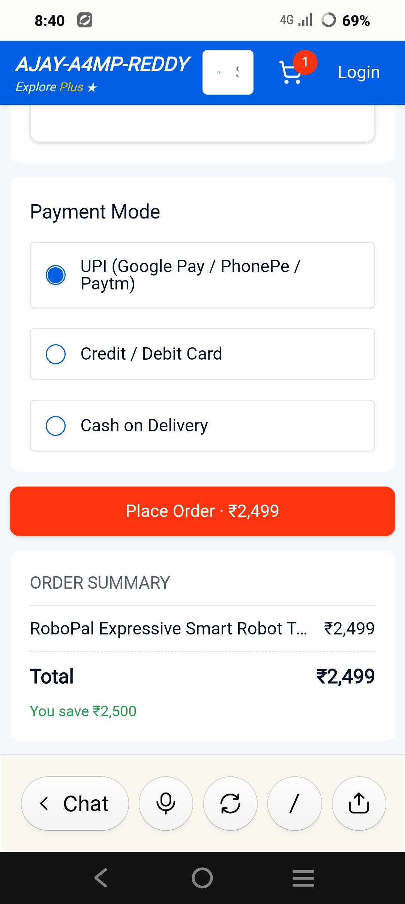</td>
    <td>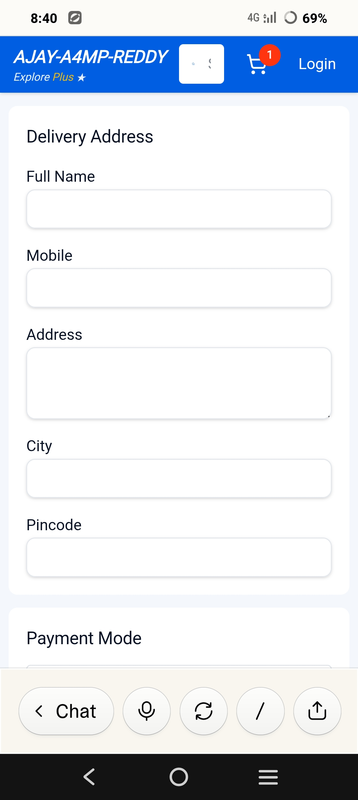</td>
    <td>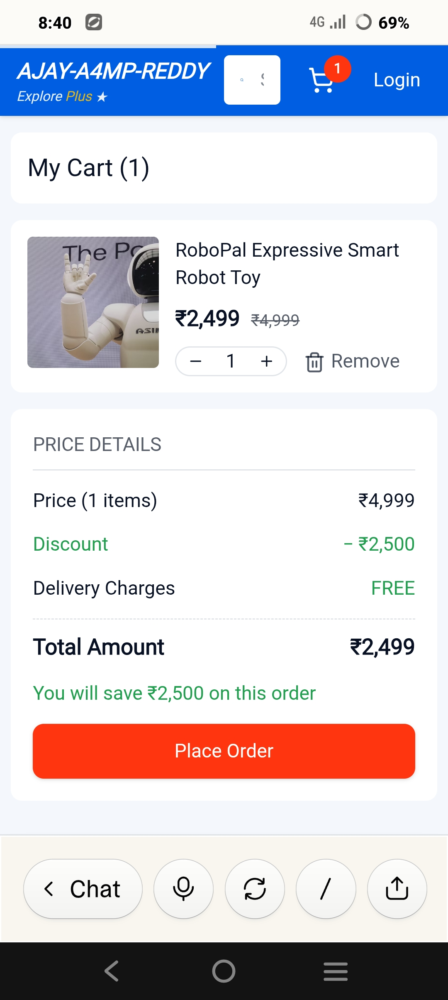</td>
  </tr>
  <tr>
    <td colspan="3" align="center">
      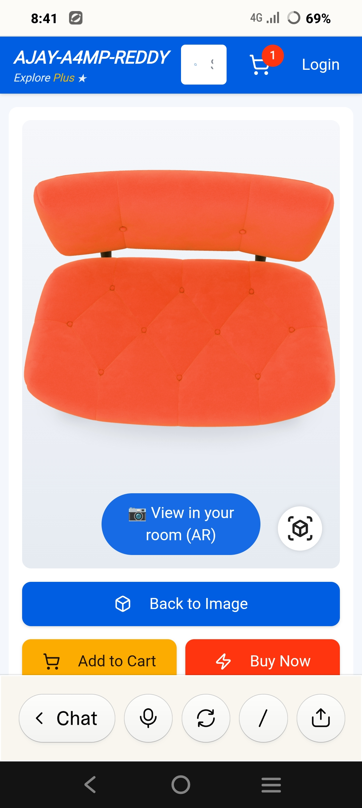
      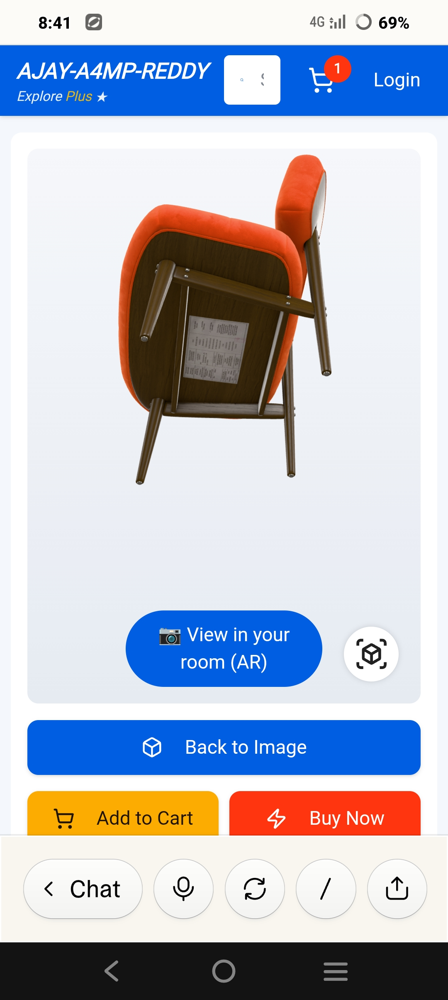
    </td>
  </tr>
</table>

---

## 💻 Getting Started

### Prerequisites
To run this project locally, you need a modern web browser that supports WebGL and WebXR (for AR features).

### Installation
1. Clone the repository:
```bash
git clone [https://github.com/AJAY-A4MP-REDDY/ajay-a4mp-reddy1.git](https://github.com/AJAY-A4MP-REDDY/ajay-a4mp-reddy1.git)
